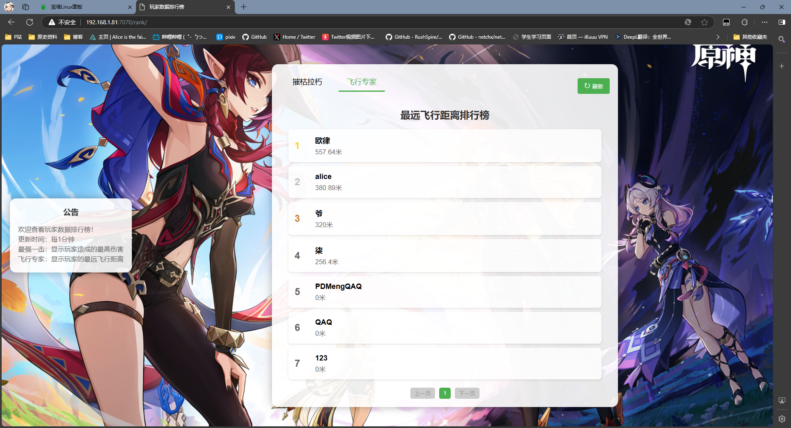
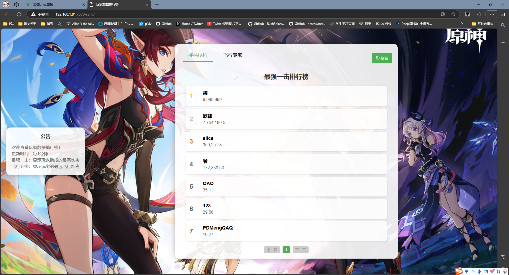

# Player-Rank

玩家数据排行榜系统 - 展示"最强一击"和"最远飞行距离"排行榜





## 📋 功能特性

- ✅ 最强一击排行榜
- ✅ 最远飞行距离排行榜
- ✅ 管理后台（配置管理、清空排行榜）


## 🚀 部署方式

自行运行bat脚本构建程序

然后更改config配置

后端默认在 `8080` 端口提供API服务


前端文件在 `rank/` 目录下，自行建站部署


#### 配置前端API地址

修改 `rank/config.js` 文件：
```javascript
window.API_CONFIG = {
    BASE_URL: 'http://你的服务器IP:8080',  // 修改为后端API地址
    API_KEY: 'genshinimpact2023'           // 与config.json中的api_secret保持一致
};
```


## ⚙️ 配置说明

编辑 `config.json` 文件：

```json
{
  "source_mysql": {        // 玩家存档数据库
    "host": "192.168.1.81",
    "port": 3306,
    "user": "work",
    "password": "your_password",
    "database": "db_hk4e_user_gio"
  },
  "target_mysql": {        // 统计数据库（可以与源数据库相同）
    "host": "192.168.1.81",
    "port": 3306,
    "user": "work",
    "password": "your_password",
    "database": "stat_db"  // 这个数据库自行创建 表结构程序会自己创建的
  },
  "sync_interval_minutes": 1,     // 数据同步间隔（分钟）  间隔时间建议多点
  "api_port": 8080,                // API服务端口
  "api_secret": "genshinimpact2023", // API密钥
  "announcement": "欢迎查看排行榜！",  // 公告内容
  "last_save_time": "2024-11-23 00:50:45"  // 数据时间阈值
}
```
last_save_time需要说明一下

这是玩家存档的最新保存时间

也就是说你可以配置这个时间来让程序只读取某个时间段之后的玩家数据


## 🔐 管理后台

访问 `http://前端地址/admin.html`

首次访问需要创建管理员账号，后续可以：
- 修改公告内容
- 调整数据同步间隔
- 设置数据时间阈值
- 清空排行榜


